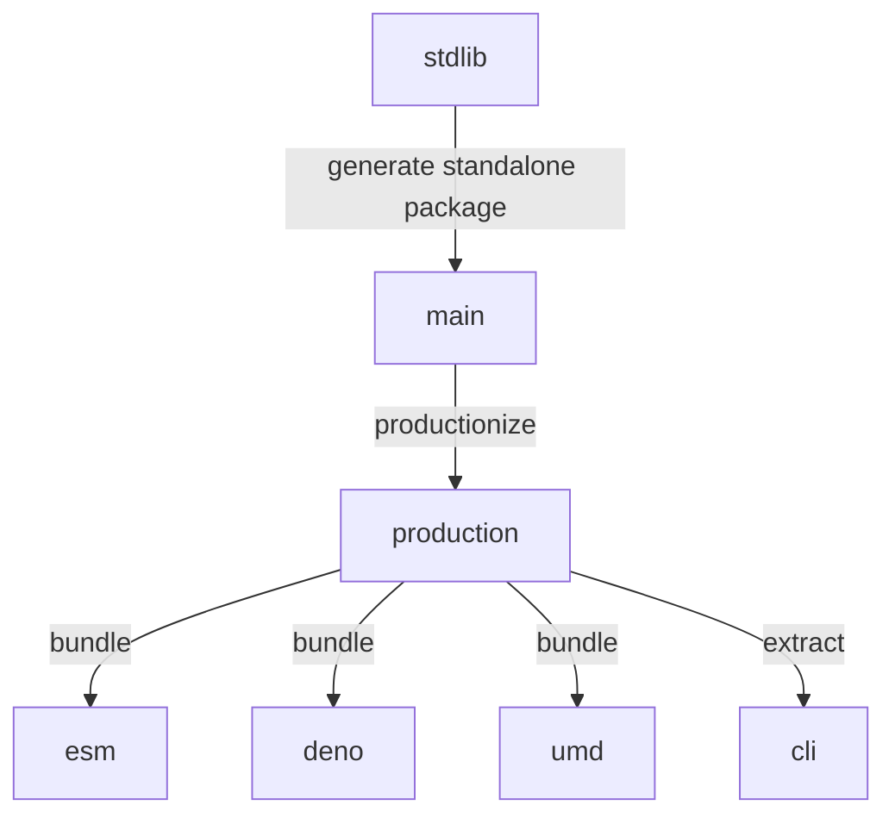

<!--

@license Apache-2.0

Copyright (c) 2023 The Stdlib Authors.

Licensed under the Apache License, Version 2.0 (the "License");
you may not use this file except in compliance with the License.
You may obtain a copy of the License at

    http://www.apache.org/licenses/LICENSE-2.0

Unless required by applicable law or agreed to in writing, software
distributed under the License is distributed on an "AS IS" BASIS,
WITHOUT WARRANTIES OR CONDITIONS OF ANY KIND, either express or implied.
See the License for the specific language governing permissions and
limitations under the License.

-->

# Branches

This repository has the following branches:

-   **main**: default branch generated from the [stdlib project][stdlib-url], where all development takes place.
-   **production**: [production build][production-url] of the package (e.g., reformatted error messages to reduce bundle sizes and thus the number of bytes transmitted over a network).
-   **esm**: [ES Module][esm-url] branch for use via a `script` tag without the need for installation and bundlers.
-   **deno**: [Deno][deno-url] branch for use in Deno.
-   **umd**: [UMD][umd-url] branch for use in Observable, or in dual browser/Node.js environments.
-   **cli**: [CLI][cli-url] branch for use on the command line.

The following diagram illustrates the relationships among the above branches:

[stdlib-url]: https://github.com/stdlib-js/stdlib/tree/develop/lib/node_modules/%40stdlib/datasets/cmudict
[production-url]: https://github.com/stdlib-js/datasets-cmudict/tree/production
[deno-url]: https://github.com/stdlib-js/datasets-cmudict/tree/deno
[umd-url]: https://github.com/stdlib-js/datasets-cmudict/tree/umd
[esm-url]: https://github.com/stdlib-js/datasets-cmudict/tree/esm
[cli-url]: https://github.com/stdlib-js/datasets-cmudict/tree/cli